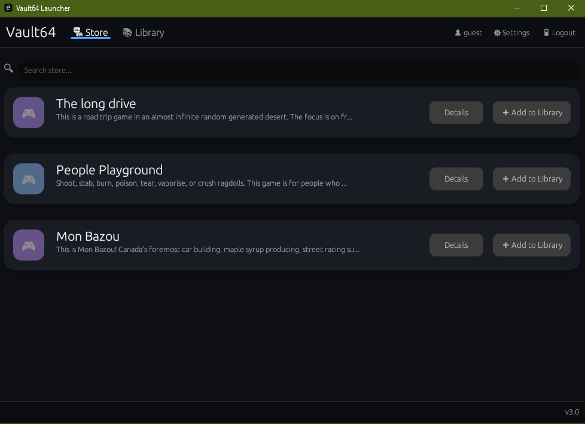

# 🎮 Vault64

Vault64 is a clean, lightweight, and modern desktop game launcher built with Rust.

## ✨ Features

- 🎨 **Modern Dark UI:** Sleek, minimal, and easy on the eyes.
- ⚡ **Blazing Fast:** Written in Rust for maximum speed and minimal RAM/CPU usage.

## 📜 License

This project is licensed under the **GPL-3.0 License**. Check the `LICENSE` file for more information.
